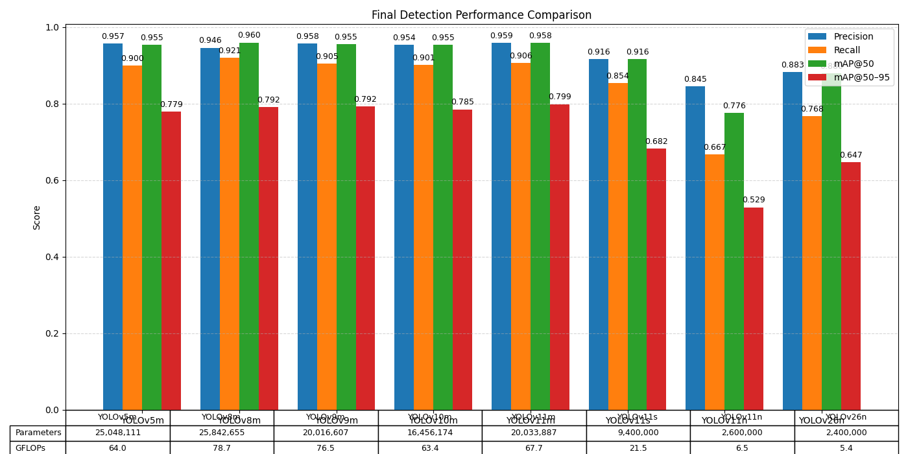

# KITTI Road Object Detection — Big Data ETL & YOLO Benchmarking

A team university project exploring large-scale data engineering and object detection model benchmarking on the [KITTI Vision Benchmark Suite](https://www.cvlibs.net/datasets/kitti/). The project covers a full ETL pipeline built with Apache Spark, a YOLO-format dataset builder, and a systematic comparison of YOLO architectures (v5 through v11) on a road object detection task — including epoch ablation and transfer learning experiments.

---

## Project Overview

| Stage | Description |
|---|---|
| **Extract** | Parse raw KITTI labels, calibration files, and images |
| **Transform** | Compute bounding box features, LiDAR-based distances, fallback distance estimation |
| **Load** | Write to Parquet via Apache Spark for downstream use |
| **Dataset Build** | Convert cleaned Parquet to YOLO-format train/val split |
| **Benchmarking** | Train and evaluate multiple YOLO architectures under controlled conditions |

---

## Repository Structure

```
kitti-road-object-detection/
│
├── etl/
│   ├── kitti_extract_transform.py   # Spark ETL: parse, transform, write Parquet
│   └── build_dataset.py             # Convert Parquet → YOLO-format dataset
│
├── config/
│   └── kitti.yaml                   # YOLO dataset config (classes, train/val paths)
│
├── benchmarking/
│   └── model_parameters.py          # Extract and save per-model validation metrics as JSON
│
├── results/
│   ├── YOLO_Final_Metrics_Comparison.png   # Final performance comparison (all models)
│   ├── yolov5m/
│   │   ├── train/                          # Ultralytics training output
│   │   └── val/                            # Ultralytics validation output
│   ├── yolov8m/
│   ├── yolov9m/
│   ├── yolov10m/
│   ├── yolov10m_50ep/                      # Epoch ablation: 50 vs 100
│   ├── yolov11m/
│   ├── yolov11m_TL/                        # Transfer learning experiment
│   ├── yolov11s/
│   ├── yolov11n/
│   └── yolov26n/
│
├── presentation.pdf                  # Full project presentation (Phase III)
│
├── data_lake/                        # Not tracked in Git (see .gitignore)
│   ├── raw/                          # Raw KITTI dataset (images, labels, calibration)
│   ├── clean/                        # Spark Parquet output
│   └── organized/                    # Final YOLO-format dataset (train/val splits)
│
├── .gitignore
└── README.md
```

---

## Dataset

**KITTI Vision Benchmark Suite** — full training split (~7,500 images)

Classes used:

| ID | Class |
|---|---|
| 0 | Car |
| 1 | Pedestrian |
| 2 | Cyclist |
| 3 | Van |
| 4 | Truck |

The dataset is not included in this repository. Download it from the [official KITTI website](https://www.cvlibs.net/datasets/kitti/eval_object.php?obj_benchmark=2d).

---

## ETL Pipeline

### Stage 1 — Extract & Transform (`etl/kitti_extract_transform.py`)

- Parses KITTI label files (bounding boxes, 3D dimensions, location)
- Parses calibration files to extract camera intrinsics (`fx`, `fy`, `cx`, `cy`)
- Computes per-object features:
  - Normalized bounding box coordinates and dimensions
  - Bounding box center, area, and aspect ratio
  - **True depth** (`loc_z`) and **Euclidean distance** from LiDAR readings
  - **Fallback distance** using the pinhole camera model: `distance = (real_height × fx) / bbox_height_px`
- Filters to 5 target classes; handles empty frames gracefully
- Outputs a single cleaned Parquet file via PySpark

### Stage 2 — Dataset Builder (`etl/build_dataset.py`)

- Reads cleaned Parquet into Pandas
- Splits by unique image filename (80/20 train/val, no data leakage)
- Copies images and writes YOLO-format label files:
  ```
  <class_id> <x_center> <y_center> <width> <height>
  ```
- Builds the full directory structure expected by Ultralytics YOLO

---

## YOLO Benchmarking

### Experiment Design

Three experiments were conducted:

**Experiment 1 — Architecture Comparison (Medium Models)**
YOLOv5m, v8m, v9m, v10m, and v11m trained under identical conditions to isolate the effect of architecture.

**Experiment 2 — Epoch Ablation**
YOLOv10m trained at 50 vs 100 epochs to evaluate whether additional training time meaningfully improves performance.

**Experiment 3 — Transfer Learning**
YOLOv11m trained from scratch vs. with transfer learning (frozen backbone) to evaluate generalization to real-world out-of-distribution data (footage recorded in Alexandria, Egypt).

### Shared Hyperparameters

All models trained under identical settings:

| Hyperparameter | Value |
|---|---|
| Epochs | 100 (50 for ablation) |
| Batch size | 4 |
| Image size | 640 |
| Learning rate | 0.01 with cosine decay |
| Dataset | KITTI (full training split) |
| Hardware | Local machines + Google Colab |

---

## Results

### Architecture Comparison



| Model | Params | GFLOPs | Precision | Recall | mAP@50 | mAP@50-95 |
|---|---|---|---|---|---|---|
| YOLOv5m | 25,048,111 | 64.0 | 0.957 | 0.900 | 0.955 | 0.779 |
| YOLOv8m | 25,842,655 | 78.7 | 0.946 | 0.921 | 0.960 | 0.792 |
| YOLOv9m | 20,016,607 | 76.5 | 0.958 | 0.905 | 0.955 | 0.792 |
| YOLOv10m | 16,456,174 | 63.4 | 0.954 | 0.901 | 0.955 | 0.785 |
| YOLOv11m | 20,033,887 | 67.7 | 0.959 | 0.906 | 0.958 | **0.799** |
| YOLOv11s | 9,400,000 | 21.5 | 0.916 | 0.854 | 0.916 | 0.682 |
| YOLOv11n | 2,600,000 | 6.5 | 0.845 | 0.667 | 0.776 | 0.529 |
| YOLOv26n | 2,400,000 | 5.4 | 0.883 | 0.768 | 0.883 | 0.647 |

**Winner: YOLOv11m** — highest mAP@50-95 (0.799) and precision (0.959) among medium models at a competitive 67.7 GFLOPs.

### Epoch Ablation — YOLOv10m (50 vs 100 epochs)

| Epochs | mAP@50-95 | F1 Score |
|---|---|---|
| 50 | 0.750 | 0.905 |
| 100 | 0.785 | 0.926 |

100 epochs outperforms 50 epochs, but the gap narrows at higher metrics — diminishing returns are visible in the loss curves.

### Transfer Learning — YOLOv11m

| Variant | mAP@50-95 | F1 Score |
|---|---|---|
| From scratch | **0.799** | **0.931** |
| With transfer learning | 0.610 | 0.812 |

Transfer learning scored lower on KITTI validation metrics — but crucially, **the from-scratch model failed to detect anything on real-world footage** recorded in Alexandria, Egypt. The transfer learning model generalized successfully to out-of-distribution data, correctly detecting cars, pedestrians, and vans in an unseen urban environment.

---

## Key Takeaways

- More epochs ≠ a better model. Validation metrics plateau; real-world performance is the true test.
- Benchmark numbers alone do not capture how useful a model is in deployment.
- Transfer learning sacrifices in-distribution accuracy for significantly better generalization to unseen environments.

---

## Environment

| Tool | Version |
|---|---|
| Python | 3.11.9 |
| PySpark | 4.0.1 |
| Ultralytics | latest at time of training |

---

## How to Run

### 1. Install dependencies

```bash
pip install pyspark pandas numpy pillow scikit-learn ultralytics
```

### 2. Run the ETL pipeline

Update the paths in `etl/kitti_extract_transform.py` to point to your local KITTI dataset, then:

```bash
python etl/kitti_extract_transform.py
```

### 3. Build the YOLO dataset

Update `PARQUET_FILE` and `SOURCE_IMAGES_DIR` in `etl/build_dataset.py`, then:

```bash
python etl/build_dataset.py
```

### 4. Train a YOLO model

```bash
yolo detect train data=config/kitti.yaml model=yolo11m.pt epochs=100 batch=4 imgsz=640 lr0=0.01
```

### 5. Extract validation metrics

Update `model_path` and `data_path` in `benchmarking/model_parameters.py`, then:

```bash
python benchmarking/model_parameters.py
```

---

## Team

Habiba Ashraf · Karim Emad · Kamal Mohamed · Omar Maysara

*AASTMT — Big Data Project*

---

## .gitignore

The `data_lake/` directory and model weights are excluded from version control:

```
data_lake/
runs/
*.pt
*.parquet
__pycache__/
*.pyc
.env
```
